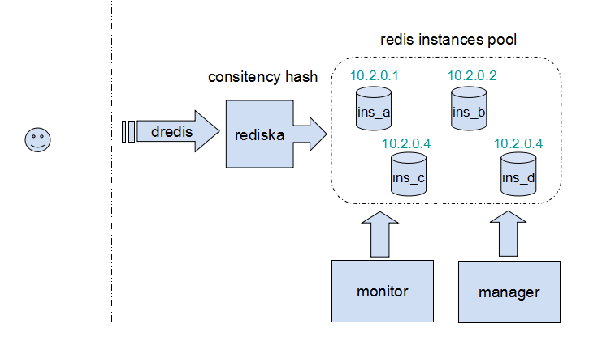

dredis
==========

### INTRO
dredis is a distributed redis system framework, which based on the
[phpredis](https://github.com/nicolasff/phpredis),
[hiredis](https://github.com/redis/hiredis) and
[rediska](http://rediska.geometria-lab.net/).

### FRAMEWORK
This figure illustrutes the framework of this project.

### AUTHOR
Aborn Jiang (aborn.jiang@foxmail.com)

### VERSION
* v0.1 2014-03-19
